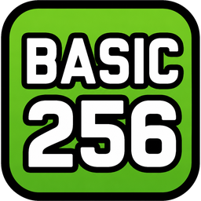
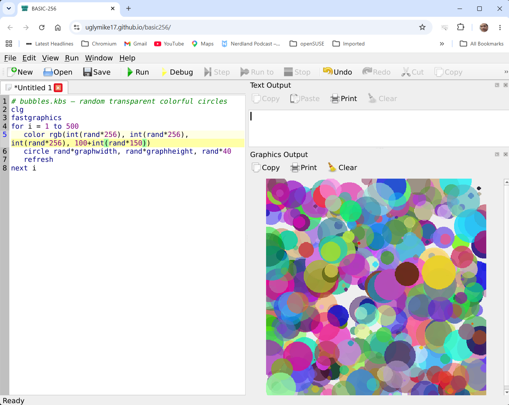
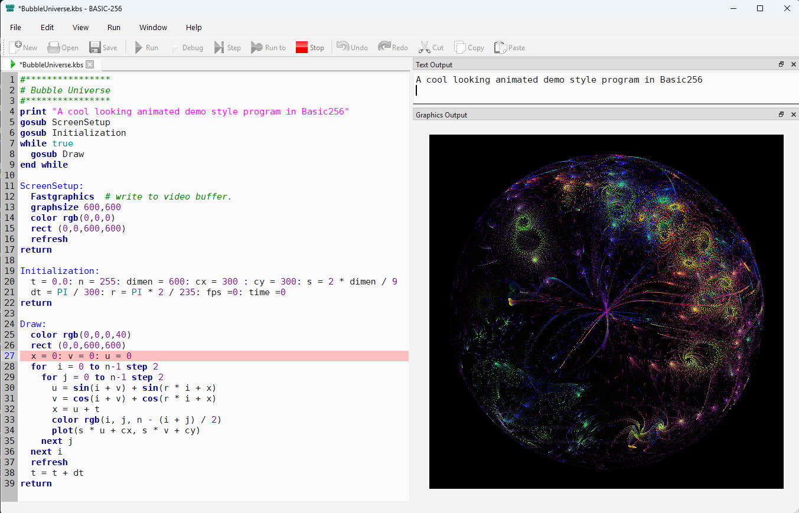

# BASIC256

[](https://github.com/uglymike17/basic256/actions)
[](https://github.com/uglymike17/basic256/releases)
[](license.txt)

> **BASIC256 is a small, approachable language that lets a beginner gradually grow into graphics, simulation, games and systems programming.**

<p align="center">
  
  &nbsp;&nbsp;&nbsp;&nbsp;&nbsp;
  
</p>

BASIC256 is a free, open-source BASIC programming environment for beginners and hobbyists. It is the actively maintained continuation of the original BASIC256, modernized for **Windows, Linux, macOS and the Web** while retaining compatibility with existing BASIC256 programs.

- 🌐 [Homepage](https://basic256.org)
- 📚 [Documentation](https://doc.basic256.org)
- ▶️ [Run BASIC256 in your browser](https://run.basic256.org)
- 💾 [Download releases](https://github.com/uglymike17/basic256/releases)

## Why BASIC256?

- Designed specifically for beginners and hobbyists
- Simple BASIC syntax
- Immediate graphics and sound
- Cross-platform desktop and Web versions
- Many example programs to learn from and experiment with
- Free and open source under GPLv3+

## Try it in your browser

No installation is needed. The WebAssembly version provides the full editor and interpreter directly in your browser.

**[▶ Run BASIC256](https://run.basic256.org)**

For example:

```basic
# bubbles.kbs — random transparent colorful circles
clg
fastgraphics

for i = 1 to 500
    color rgb(int(rand*256), int(rand*256), int(rand*256), 100+int(rand*150))
    circle rand*graphwidth, rand*graphheight, rand*40
    refresh
next i
```



The browser version supports several useful URL modes:

| URL parameter | Purpose |
|---|---|
| `?run=name` | Run a bundled Example |
| `?url=path/file.kbs` | Load a program from the site |
| `?src=...` | Load source encoded in the URL |
| `&mode=ide` | Full IDE, auto-run |
| `&mode=edit` | Full IDE, loaded but not run |
| `&mode=graph` | Graphics-only mode |
| `&mode=text` | Text-only mode |
| `&mode=app` | Text + graphics, without the editor |

For example:

- `https://run.basic256.org/?run=Mandelbrot-256&mode=graph`
- `https://run.basic256.org/?run=BubbleUniverse_variations`

This makes the Web version useful not only for learning, but also for sharing and embedding BASIC256 programs.

### Hosting it yourself

Copy the WASM build to any static host served over **HTTPS**, and send these two headers that the multithreaded build relies on:

```
Cross-Origin-Opener-Policy: same-origin
Cross-Origin-Embedder-Policy: require-corp
```

With those in place the page loads in a single pass — no reload — and the bundled `coi-serviceworker` helper (only needed because GitHub Pages can't send those headers itself) is no longer required.

### Browser differences

The browser runs inside a sandbox, so some desktop features are unavailable:

- Files created by a running program exist only for the current browser session.
- Programs in the editor persist across refreshes.
- `SOUND`, `SAY` and related features use browser audio/speech support and could be unavailable.
- TCP networking, `SYSTEM`, serial ports, database/SQL and printer commands are unavailable.
- Large fractals and simulations generally run slower than on the desktop.
- Media such as `SOUNDLOAD` and `IMGLOAD` can be loaded from paths relative to the Web page, subject to normal browser CORS rules.

## What's new

### BASIC256 2.3.0

#### 🔒 Security & Filesystem
- **File Access Prompts:** Accessing files/folders outside the program's root directory now triggers a user confirmation prompt (`OPEN`, `KILL`, `MKDIR`, `IMGSAVE`, `DBOPEN`, SQL targets, etc.).
- **Loopback Network Default:** `NETLISTEN` now listens exclusively on `127.0.0.1` by default. Network access can be enabled in *Preferences/Advanced*.
- **Directory Commands:** `MKDIR` restored (works without `SYSTEM`). `RMDIR` has been permanently removed for safety.

#### 💻 Text & Console Enhancements
- **`TEXTSCREEN` Added:** Convert the Text Output window into a true grid-based character screen with fixed dimensions and optional square cells (`TEXTSCREEN cols, rows [, square]`).
- **Console Controls:** `LOCATE` positions the cursor for in-place overwriting. Added `TEXTCOLOR`, `TEXTBACKGROUND`, `TEXTFONT`, and `TEXTCHAR()`.

#### 🎨 Graphics & Audio
- **Color & Sprites:** Added `HSV(h, s, v [, a])` color function, 3D Noise support via `NOISE(x, y, z)`, and `SPRITETEXT` to render text directly onto sprites.
- **Sprite Scaling:** `SPRITEW` and `SPRITEH` now accurately report transformed dimensions.
- **Coordinate Mapping:** `IMGLOAD`, `GETSLICE`, and `PUTSLICE` now respect custom `WINDOW` coordinates.

#### ⚙️ Language & Core Fixes
- **Array Sorting:** New built-in `SORT` statement for 1D and 2D arrays (`SORT array [, col] [, ASCENDING|DESCENDING] [, IGNORECASE]`).
- **Subroutine Pass-by-Reference Fix:** Subroutines declaring `ref()` parameters now correctly modify the caller's target variable passed without an explicit `ref()` wrapper.
- **Syntax Improvements:** Fixed an issue where statements without arguments followed by a colon (e.g., `NEXT:`, `CLS:`) were misidentified as labels.

#### 📦 Platform & Suite Updates
- **Raspberry Pi:** Fixed missing SQLite driver error for `DBOPEN`. Added `TestSuite` and `Benchmark` to Pi archives.
- **Benchmarking & Examples:** Added `TestSuite/Benchmark` utility and a new SQLite console demo (`Examples/DataBase/GamesDB.kbs`). 

#### 🌐 Homepage Enhancements
* **Gallery Page** There is now a Gallery page on basic256.org where you can run the examples directly in a pop-up Browser window.

### BASIC256 2.2.0

#### ⚡ Performance & Memory
- **Execution Speedup:** Overall execution is 20–25% faster due to optimized runtime value handling across arithmetic, drawing, and array operations.
- **Array Optimization:** Arrays use ~50% less memory. Whole-array operations (`DIM`, `REDIM`, array copying, `MAT` statements) run 3–5x faster.

#### 📐 New Features & Math Operators
- **Vector Operators:** Added `DOT`, `CROSS`, `NORM(v)`, and `UNIT(v)` for vector arithmetic on standard 1D/2D arrays.
- **Matrix Operators:** New `MAT` statement adds following matrix operations: `MUL`, `ADD`, `SUB`, `INV` and `TRN`.
- **Turtle Graphics Module:** Added `Modules/turtle.kbs` (`INCLUDE "turtle.kbs"`) for turtle-style relative drawing (`t_forward`, `t_left`, `t_goto`, etc.).
- **`FRAMERATE` Control:** New `FRAMERATE fps` statement locks drawing loops to a target frame rate (e.g., `FRAMERATE 60`), automatically adjusting for system speed differences.
- **OpenSimplex noise:** Added `NOISE` for smooth, repeatable OpenSimplex noise (ideal for terrain, clouds, and paths). Tied to `SEED` for deterministic output.

#### ⚙️ Core Enhancements & Fixes
- **Unlimited File Size:** Removed the ~5,000-line program length limit (including `INCLUDE` files).
- **Improved `PAUSE`:** Accurate millisecond-level precision across all platforms; instantly interruptible by clicking Stop.
- **Syntax Adjustments:** `MOD` is now a case-insensitive keyword (reserved word).

#### 🎨 Custom Coordinates & Rendering
* **`WINDOW` Statement:** Set custom coordinate systems and axis orientations (`WINDOW x1, y1, x2, y2`), with middle-point centering or graph paper orientation. `MOUSEX`, `MOUSEY`, `PIXEL`, etc. adapt automatically.
* **Subpixel Drawing:** Graphics statements (`PLOT`, `LINE`, `CIRCLE`, `RECT`, `TEXT`, etc.) now accept fractional coordinates for precision positioning.

#### ⚙️ Code Readability
* **Multi-line Literals:** Array and map literals (`{ ... }`) can now span multiple lines with inline comments (`#`), allowing clean table and matrix layouts.

### BASIC256 2.1.1

#### ⚡ Performance Improvements
* **Faster Execution:** Arithmetic-heavy loops run roughly 2x faster due to internal memory reuse for intermediate values and reduced interpreter step overhead. Gains are highest in the WASM/browser build.

#### 🌐 Browser (WASM) Enhancements
* **Session Persistence:** Editor state, open tabs, active selection, and file names now auto-persist in the browser across tab closes, page refreshes, or browser restarts.

#### 🪟 Windows & UI Fixes
* **Windows 11 Scaling:** Menu bar titles (`File`, `Edit`, `View`, etc.) now properly scale and adjust spacing based on system text size settings.
* **Streamlined Windows Installer:** Removed the redundant standalone Microsoft VC++ Redistributable installer file (still bundled within the main installer when needed).
* **Updated Links:** Updated *Help/About* to include the main site (`https://basic256.org`) alongside the documentation portal.

### BASIC256 2.1.0

> **Major Update:** BASIC-256 has migrated to **Qt 6**, enabling WebAssembly (WASM) browser execution, modern UI features, and relicensing to **GPL v3 or later**.

#### 🖥️ IDE & Modernization
* **Qt 6 & WASM Support:** Ported codebase to Qt 6 and CMake. You can now run BASIC-256 directly in a web browser!
* **UI Themes & Layout:** Added **Light**, **Dark**, and **Follow System** themes (*View/Theme*). Window maximizing and docking now preserve balanced pane proportions.
* **New `MAXIMIZE` Statement:** Programmatically maximize (`MAXIMIZE 1`) or restore (`MAXIMIZE 0`) the IDE window.
* **Mascot & Visuals:** Introduced new program logo, transparent app icons across all platforms, and the **BitBot** mascot.
* **Built-in Modules:** `INCLUDE` statements now directly access bundled libraries (e.g., `include "math.kbs"`) in the browser.

#### 🌐 WebAssembly (WASM) & Mobile
* **Mobile Audio & Touch:** Full audio/speech support on iPad/iPhone and touch-driven interaction for browser demos.

#### 💻 CLI & macOS
* **New CLI Flags:** `-f` (fullscreen run), `-s` (silent mode with suppressed screen output for background processing/testing), and `-g` (shows graphics pane only).
* **macOS Sequoia:** Added official Intel macOS support (requires macOS 15+).

#### 📚 Documentation & Help
* **New Documentation Portal:** Replaced legacy docs with a modern Docusaurus site at `doc.basic256.org` (accessible via `F1` or *Help/Online Help*).
* **Documented Features:** Added docs for `ELLIPSE`, `SETGRAPH`, `GETARRAYBASE`, optional `LET`, bit-shifts (`<<`, `>>`), and compound assignments (`&=`, `;=`).

## Desktop application

The desktop application provides the familiar BASIC256 three-pane environment:

- **Editor** — write and edit BASIC programs.
- **Text Output** — program output and console-style interaction.
- **Graphics Output** — immediate drawing and animation.

The same BASIC256 programs can therefore be developed on the desktop and shared through the Web version.



## Download & install

Get the latest builds from the **[Releases](https://github.com/uglymike17/basic256/releases)** page.

| Platform | Status | Notes |
|---|:---:|---|
| Windows | ✅ | ZIP and installer builds available. SmartScreen will initially block the installer as it comes from an unknown source — "More info" → "Run anyway" fixes this. |
| Linux x86 | ✅ | Tarball, AppImage and `.deb` packages. BASIC256 2.1.1 is in Debian 14 "Forky" main and in Debian Unstable "sid" main. |
| Raspberry Pi | ✅ | Tarball and AppImage builds. BASIC256 2.1.1 is in Raspbian Testing main. |
| macOS Apple Silicon | ⚠️ | Requires macOS 15 (Sequoia) or newer. |
| macOS Intel | ⚠️ | Requires macOS 15 (Sequoia) or newer. Separate x86_64 build. |
| WebAssembly | 🧪 | Usable, with the browser limitations described above. |

### macOS

The supplied macOS applications are ad-hoc signed rather than notarized. If Gatekeeper reports that the application is damaged, try:

```console
xattr -cr /Applications/basic256.app
```

For older macOS versions, the original Qt5-based BASIC-256 2.0.0.11 may be an alternative, or BASIC256 can be built from source against Qt 5.15.

### Raspberry Pi

The Raspberry Pi build is intended for modern Raspberry Pi Linux installations. Speech support may require `speech-dispatcher` to be installed separately.

## Command line

BASIC256 can also run programs from a terminal:

| Short | Long | Effect |
| :---: | :--- | :--- |
| -h (-? on Windows) | --help | Display command-line help. |
| | --help-all | Display command-line help including Qt-specific options. |
| -v | --version | Display the BASIC-256 version. |
| -r | --run | Load and run the specified .kbs program. Must precede the filename. |
| -a | --app --application | Load and run the specified .kbs without the Edit window. |
| -g | --graph | Load and run the specified .kbs with only the Graphics window. |
| -t | --text | Load and run the specified .kbs with only the Text window. |
| -f | --full | When used with -r/-a/-t/-g, the full screen area will be used. |
| -s | --silent | Run the specified .kbs with no GUI at all: PRINT goes to stdout, errors to stderr, and the exit code says whether it worked. Needs a filename, and cannot be combined with -r/-a/-g/-t. |
| -l | --lang --language | Start BASIC-256 using the specified language. |

For example:

```console
basic256 -g Mandelbrot-256.kbs
basic256 -f -t Zork256.kbs
basic256 -s TestProgram.kbs
```

## Examples

The repository contains a large collection of example programs covering graphics, games, mathematics, simulations, sound and other BASIC256 features.

The original minimal examples from BASIC256 2.0.0.11 are preserved under:

```text
Examples/Original_Examples/
```

Additional examples can be found at [Manuel Santos' BASIC256 blog](https://basic256.blogspot.com/).

## Standard library

BASIC256 includes 2 small standard libraries:

1. Modules/math.kbs

Use it with:

```basic
include "math.kbs"
```

It currently provides functions including:

`minarr`, `maxarr`, `sumarr`, `avgarr`, `sign`, `min`, `max`, `lerp`, `hypot`, `atan2`, `clamp`, `remap`, `wrap`, `dist`, `fmod`, `fround`, `cbrt`, `randint` and `gaussian`.

These are implemented as BASIC256 code rather than built-in language commands, keeping the language itself small while making common operations convenient.

2. Modules/turtle.kbs

Use it with:

```basic
include "turtle.kbs"
```

This provides turtle logic with following subroutines:  

`t_reset`, `t_goto`, `t_home`, `t_forward`, `t_backward`, `t_right`, `t_left`, `t_setheading`, `t_penup`, `t_pendown`, `t_x`, `t_y`, `t_getheading`, `t_getpen`  
and short-codes `t_fw`, `t_bw`, `t_pu`, `t_pd`, `t_r`, `t_l`

## Build from source

Detailed build instructions are in:

- [COMPILING.txt](COMPILING.txt)
- [COMPILING_RaspberryPI.txt](COMPILING_RaspberryPI.txt)

The project uses **CMake, Qt6 and GitHub Actions**, with builds for Windows, Linux, Raspberry Pi, macOS and WebAssembly.

## Project history

BASIC256 began as **KidBasic** in 2006, created by Ian Paul Larsen and later maintained by James Reneau and other contributors through SourceForge. The original project eventually became BASIC256 and reached version 2.0.0.11.

This repository is a continuation of that project. It started from the 2.0.99.10.2 development branch with the goal of modernizing the codebase while preserving its educational character and compatibility.

The major development steps have been:

- **2.1.0** — modern build system, portability and new platforms.
- **2.1.1** — significant performance improvements and Web persistence.
- **2.2.0** — new language features, mathematics, graphics capabilities and further performance improvements.
- **2.3.0** — safer system access and enhanced text-console capabilities.

The original copyright notices have been retained.

## Roadmap

Development continues with an emphasis on **education, portability, performance and compatibility**.

Current areas of interest include:

- More distribution packages
- More standard modules
- More and better examples
- Educational tutorials
- New language features where a module would be too slow
- Continued improvements to documentation and deployment

## Contributing

BASIC256 is a hobbyist/open-source project and contributions are welcome.

You can help by:

- Reporting bugs
- Improving documentation
- Writing examples
- Translating documentation
- Testing releases
- Improving tutorials
- Submitting pull requests

Use:

- [Issues](https://github.com/uglymike17/basic256/issues) for bugs and feature requests
- [Discussions](https://github.com/uglymike17/basic256/discussions) for questions, ideas and projects
- [Discord](https://discord.gg/8QaSGYAQ9R) to join the community

## License

BASIC256 is distributed under the **GNU General Public License version 3 or later (GPLv3+)**.

The original project used GPLv2 "or (at your option) any later version", allowing this continuation to move to GPLv3+. See [license.txt](license.txt) for the full license.

Two components retain their compatible original licenses:

- `src/core/md5.cpp` / `md5.h` — RSA Data Security code adapted by Frank Thilo
- `src/gui/LineNumberArea.cpp` / `.h` — BSD-licensed code from the Qt examples

## Maintainer

BASIC256 is maintained as a hobbyist/open-source project with the help of modern AI development tools. Contributions to the code, examples, documentation and translations are especially welcome.
